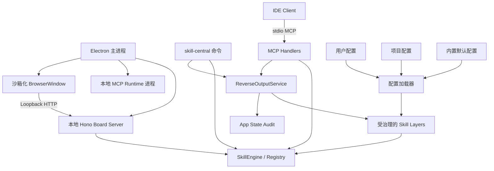
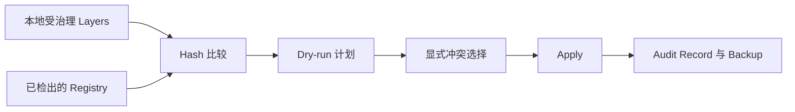
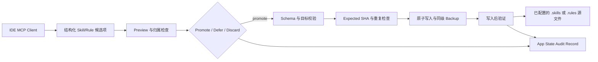

# 系统架构

[English](../en/architecture.md) | [文档首页](./README.md)

## 目标

Skill Central 是一个本地优先的可复用 AI Skill 控制中心。它从受治理的本地 Layer 加载 Skill 定义，确定性地解决同 ID 冲突，通过 MCP 暴露有效 Skill，并通过 CLI、Web Board 与桌面应用管理同一份状态。

项目明确区分源资产与派生运行状态。Skill YAML 文件是持久化事实来源；Registry 视图、编译预览、健康报告和 UI 状态都由源资产派生。

## 运行入口

桌面壳不会向渲染进程提供 Node.js 权限。Electron 启动 loopback Board Server，在启用沙箱和上下文隔离的 `BrowserWindow` 中加载页面，并将外部链接交给系统浏览器。CLI 与桌面端复用相同的 TypeScript 服务，不各自维护业务逻辑。

## 核心模块

| 边界 | 职责 | 不应负责 |
| --- | --- | --- |
| `src/storage/` | 加载配置、发现 YAML、解析 Schema、标准化 Layer 元数据 | IDE 写入或 UI 渲染 |
| `src/schema/` | 定义并校验 Universal Skill v1 | 文件发现或协议传输 |
| `src/core/`、`src/registry/` | 解决冲突、输出有效与诊断视图、查询 Skill | 解析 IDE 配置 |
| `src/compiler/`、`src/adapters/` | 按意图选择 Skill、协商能力、生成预览产物 | 在 dry-run 中修改 IDE 配置 |
| `src/protocol/`、`src/mcp.ts` | 将有效 Skill 和证据映射为 MCP prompts、tools、resources | 直接读取 Layer 文件 |
| `src/reverse-output/`、`src/commands/reverse-output.ts` | 校验、预览、Promote、Defer、Discard、Audit 和回退 IDE 生成的 Skill/Rule 候选项 | 绕过作用域、Schema、冲突或 Backup 检查 |
| `src/ide-detection/` | 定义 IDE、候选路径以及 JSON/TOML Codec | 执行未计划的写入 |
| `src/connect/`、`src/health/` | 计划、应用、验证和回退 IDE 注册 | 在各模块独立猜测目标路径 |
| `src/sync/`、`src/auth/` | GitHub Device Flow、Registry 扫描、同步计划和执行证据 | 在浏览器状态中保存凭据 |
| `src/local-store/`、`src/state/`、`src/scheduler/` | App State、Session、Blackboard Topic 与 Workflow 推进 | 持有 Skill 源文件 |
| `src/web/` | Loopback HTTP API 与静态 Board | 重复实现 Engine 的解析规则 |
| `src/desktop/`、`src/update/` | Electron 生命周期和平台更新控制器 | 向渲染页面暴露 Node.js |

## 启动流程

### MCP 进程

1. `skill-central mcp` 加载用户与项目 Layer 配置。
2. `SkillEngine` 读取并校验 Layer 文件，然后构建 Override Tree。
3. 注册 prompts、tools 与只读 resources 的 MCP Handler。
4. Server 通过 stdio 连接。协议帧使用 stdout，诊断信息使用 stderr。

### Web Board

1. `skill-central board` 默认拒绝非 loopback 地址，除非操作者提供显式风险确认参数。
2. Server 加载配置并初始化共享 `SkillEngine`。
3. 浏览器通过 JSON API 完成 Skill 查询、编辑、IDE 连接、同步、Runtime、认证和更新操作。
4. Skill 编辑会校验 YAML、拒绝修改 ID、创建备份、写入源文件并重新加载 Engine。

### 桌面应用

1. Electron 在 `127.0.0.1` 上从 `5417` 到 `5427` 寻找可用端口。
2. 启动与 CLI 相同的 Board Server。
3. 在启用沙箱、上下文隔离且关闭 Node Integration 的窗口中加载 Board。
4. 使用桌面 IDE 连接计划写入 IDE 配置的同一个启动入口，启动一个本地 MCP stdio Runtime。
5. 打包版本在首个窗口加载后不久执行一次更新检查。

## 主要数据流

### Skill 解析

解析先比较 priority，再比较 scope distance。无法区分的并列项会成为显式冲突，并从有效 Skill 视图中排除。详见 [Skills 与 Layers](./skills-and-layers.md)。

### IDE 连接

系统只新增或替换 `skill-central` Server Entry，保留其他 MCP 配置。详见 [IDE 集成](./ide-integration.md)。

### 本地 Runtime

Board 的 Runtime 视图观察桌面进程持有的本地 MCP stdio 进程。它是打包启动入口的运行烟测面，
不是供 IDE 共用的 MCP Daemon。该进程空闲时也必须保持 stdin 打开；关闭 stdin 会让 MCP
Server 退出，并使 Runtime Snapshot 回到 `stopped`。IDE 健康验证仍会独立启动写在对应 IDE
MCP 配置里的命令；只有该配置进程无法 Spawn 或在 Probe 中退出时，才报告 `server-stopped`。

在 macOS 上，该子进程是同一 App 可执行文件的第二个 Electron 实例，默认 Regular 激活策略
会在程序坞额外占据一个图标。MCP 分支因此调用 `app.dock.hide()`，使程序坞只为主应用保留
一个图标。

### Registry 同步

关闭同步的 Layer 会被标记为 excluded，不会静默上传。远端写入需要显式执行 Apply。

### 反向输出

反向输出是受控的源文件修改，不是文本导出。MCP Tool 与 CLI 共用同一个服务。
Preview 不写入；只有显式 `promote` 才会写入。更新必须提供 expected SHA-256，生成
同级 Backup，并可使用另一个 expected SHA-256 回退。Rule 只有在属于 Skill Central
公约时才 Promote；持续演进的工作知识通常应沉淀为 Skill。

## 架构不变量

所有改动必须保持以下规则：

1. **本地源文件所有权：** 清理 App State 不得删除 Skill Source Layer。
2. **单一解析权威：** CLI、MCP、Board、Compiler 和 Sync 使用 Registry/Engine 结果，不得各自选择 winner。
3. **可解释冲突：** 完全并列时不得依赖插入顺序决胜。
4. **受计划约束的高权限写入：** IDE 与 Sync 修改必须展示计划并保留回退或审计证据。
5. **结构化配置：** JSON、TOML、YAML 必须使用 Parser 与 Codec，不得用文本替换模拟解析。
6. **纯净 MCP 传输：** stdout 只用于 stdio JSON-RPC。
7. **Runtime stdin 所有权：** 受管理的 stdio MCP Runtime 必须保持 stdin 打开，直到显式停止或应用退出。
8. **默认 Loopback：** Board 是无认证的本地管理面，禁止意外暴露。
9. **凭据隔离：** Access Token 不得返回浏览器或与 Skill 一起存储。
10. **纯 Dry-run：** Compile 与 Sync Planning 不得修改目标。
11. **双语 UI 契约：** Board 的用户可见文本必须同时支持英文和简体中文。
12. **显式反向输出：** IDE 生成的内容必须先完成归属与理由、作用域、Schema、冲突、
    验证和 promote/defer/discard 证据，才能成为源资产。

## 扩展点

- 新增 IDE 连接目标时，必须同时完成共享 Registry、候选路径、Codec、事务、UI 元数据与测试。
- 新增编译目标时，通过 Adapter Registry 和能力声明扩展。IDE 连接目标与编译目标是两组独立能力。
- 新增 Skill 类型时，需要贯穿 Universal Schema、标准化、Registry、Protocol/Compiler Consumer 和测试 Fixture。
- 新增存储后端时，应实现 `TokenStore` 等既有接口，不得让调用方依赖具体存储路径。

跨边界改动应先创建 Issue 并取得设计共识。审查边界以贡献指南为准。

## 当前 Alpha 限制

- 正式桌面 GitHub 凭据已接入 macOS Keychain/Windows DPAPI；CLI 仍使用开发型文件 `TokenStore`，Windows 实机行为尚未验证。
- macOS 安装包为本地 ad-hoc 签名（无 Developer ID）、未公证。
- macOS/Windows 桌面应用内更新通过 GitHub Release Metadata，仍属于 Alpha 能力，每次 Release 都必须重新验证。
- Compiler Adapter 当前只有 generic MCP、Cursor 和 Windsurf，少于六个 IDE 连接目标。
- 反向输出当前是通过 MCP 与 CLI 提供的 Alpha MVP；Board 尚未提供反向输出提案或 Promote 控件。
- Board 没有用户认证。非 loopback 绑定是高风险高级覆盖，不是部署模式。
