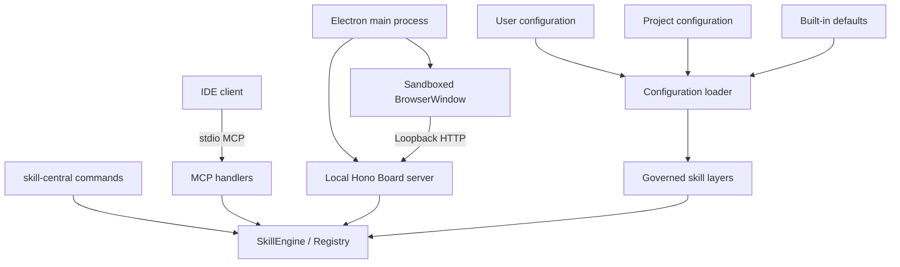
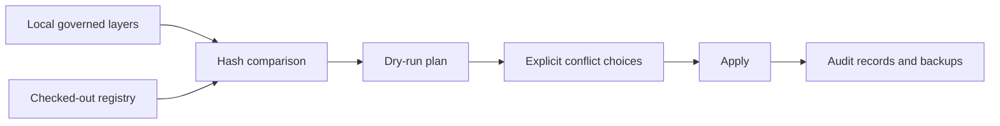

# Architecture

[简体中文](../ch/architecture.md) | [Documentation index](./README.md)

## Purpose

Skill Central is a local-first control plane for reusable AI skills. It loads skill definitions from governed local layers, resolves collisions deterministically, exposes effective skills through MCP, and provides CLI, Web Board, and desktop workflows for managing the same state.

The project deliberately separates source assets from derived runtime state. Skill YAML files remain the durable source of truth; registry views, compile previews, health reports, and UI state are derived from them.

## Runtime Surfaces

The desktop shell does not grant Node.js access to renderer code. Electron starts the loopback Board server, loads it in a sandboxed `BrowserWindow`, and opens external links in the operating system browser. The CLI and desktop surface reuse the same TypeScript services rather than maintaining separate business logic.

## Major Components

| Boundary | Responsibilities | Must not own |
| --- | --- | --- |
| `src/storage/` | Load configuration, discover YAML, parse schemas, normalize layer metadata | IDE writes or UI rendering |
| `src/schema/` | Define and validate Universal Skill v1 | Filesystem discovery or protocol transport |
| `src/core/` and `src/registry/` | Resolve collisions, expose effective and diagnostic views, query skills | Parse IDE configuration |
| `src/compiler/` and `src/adapters/` | Select skills for an intent, negotiate target capabilities, build preview artifacts | Change IDE configuration during dry-run |
| `src/protocol/` and `src/mcp.ts` | Map resolved skills and evidence to MCP prompts, tools, and resources | Read layer files directly |
| `src/ide-detection/` | Define IDE targets, candidate paths, and JSON/TOML codecs | Perform unplanned writes |
| `src/connect/` and `src/health/` | Plan, apply, verify, and roll back IDE registration | Guess target paths independently |
| `src/sync/` and `src/auth/` | GitHub Device Flow, registry scans, sync plans, apply evidence | Store credentials in browser state |
| `src/local-store/`, `src/state/`, `src/scheduler/` | App-state paths, sessions, blackboard topics, workflow progression | Own skill source files |
| `src/web/` | Loopback HTTP API and static Board | Duplicate engine resolution rules |
| `src/desktop/` and `src/update/` | Electron lifecycle and platform update controllers | Expose Node.js to renderer content |

## Startup Flows

### MCP process

1. `skill-central mcp` loads global and project layer configuration.
2. `SkillEngine` reads and validates layer files, then builds the override tree.
3. MCP handlers are registered for prompts, tools, and read-only resources.
4. The server connects over stdio. Protocol frames use stdout; diagnostics use stderr.

### Web Board

1. `skill-central board` refuses a non-loopback host unless the operator supplies an explicit acknowledgement flag.
2. The server loads configuration and initializes a shared `SkillEngine`.
3. The browser uses JSON APIs for skill queries, edits, connections, sync, runtime, authentication, and updates.
4. Skill edits validate YAML, reject ID changes, create a backup, write the source, and reload the engine.

### Desktop application

1. Electron finds an available port from `5417` through `5427` on `127.0.0.1`.
2. It starts the same Board server used by the CLI.
3. It loads the Board in a sandboxed window with context isolation and no Node integration.
4. A packaged build checks for updates shortly after the first window loads.

## Primary Data Flows

### Skill resolution

Resolution uses priority first and scope distance second. An unresolved tie is represented as an explicit conflict and is excluded from the effective skill view. See [Skills and Layers](./skills-and-layers.md).

### IDE connection

Only the `skill-central` server entry is added or replaced. Other MCP entries are preserved. See [IDE Integration](./ide-integration.md).

### Registry sync

Layers with sync disabled are reported as excluded rather than silently uploaded. Remote writes require an explicit apply operation.

## Architectural Invariants

Changes must preserve these rules:

1. **Local source ownership:** App-state cleanup must not delete skill source layers.
2. **One resolution authority:** CLI, MCP, Board, compiler, and sync consumers use Registry/engine results instead of implementing their own winner selection.
3. **Explainable conflicts:** A tie never resolves through insertion order.
4. **Planned privileged writes:** IDE and sync mutations expose a plan and retain rollback or audit evidence.
5. **Structured configuration:** JSON, TOML, and YAML are handled through parsers and codecs, not text substitution.
6. **Clean MCP transport:** stdout is reserved for stdio JSON-RPC.
7. **Loopback by default:** The Board is an unauthenticated local administration surface and must not be exposed accidentally.
8. **Credential separation:** Access tokens are not returned to browser code or stored with skills.
9. **Dry-run purity:** Compile and sync planning do not mutate their targets.
10. **Bilingual UI contract:** User-visible Board strings must remain available in English and Simplified Chinese.

## Extension Points

- Add an IDE connection target through the shared target registry, path candidates, codec support, transaction behavior, UI metadata, and tests.
- Add a compile target through the adapter registry and a capability declaration. Connection targets and compile targets are intentionally separate sets.
- Add a skill type through the universal schema, normalization, Registry behavior, protocol/compiler consumer behavior, and fixtures.
- Add a storage backend behind an existing interface, such as `TokenStore`, rather than leaking backend details into callers.

Cross-boundary changes require an issue and design agreement before implementation. The contribution guide defines the review boundary.

## Current Alpha Limitations

- Official desktop GitHub credentials use macOS Keychain/Windows DPAPI; the CLI still uses the development file TokenStore, and real Windows behavior remains unverified.
- macOS packages are unsigned and not notarized.
- The Homebrew-managed macOS update path is public in `1.0.0-alpha.2`, but remains alpha and must be reverified for each release.
- Compiler adapters currently exist for generic MCP, Cursor, and Windsurf; this is narrower than the six IDE connection targets.
- The Board has no user authentication. Non-loopback binding is an advanced, high-risk override, not a deployment mode.
